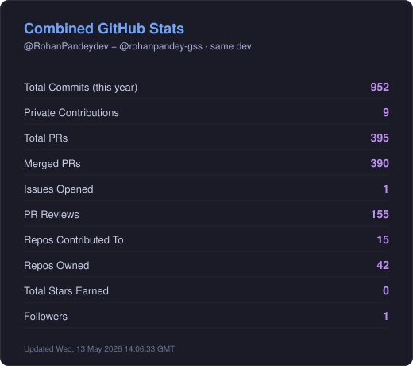
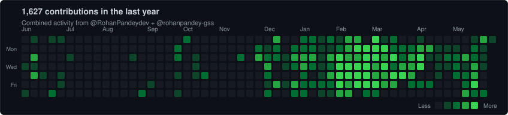

# 👋 Hi, I'm Rohan Pandey

---

## 🚀 About Me

💻 **Full Stack Developer** building modern web apps & immersive 3D experiences
🌱 Currently exploring **Three.js, React Three Fiber, and creative web development**
🎨 Love crafting interactive UIs and 3D portfolio experiences
💡 Open to collaboration on innovative JavaScript projects
🏢 Active across [@RohanPandeydev](https://github.com/RohanPandeydev) (personal) and [@rohanpandey-gss](https://github.com/rohanpandey-gss) (work at Grass Stone) — same dev, two accounts
📫 Reach me: **rohan.kr.pandey2.0@gmail.com**

---

## 🛠️ Tech Stack

*Curated from real commits across [@RohanPandeydev](https://github.com/RohanPandeydev) and [@rohanpandey-gss](https://github.com/rohanpandey-gss)*

### Languages

### Frontend

### Backend & Data

### 3D / Graphics

### DevOps & Cloud

### Tools

---

## 📊 GitHub Statistics

---

## 📈 Contribution Graph

---

## 🟩 Combined Contribution Activity

### 🐍 Snake (Personal Account)

---

## 🌐 Connect With Me

---

### 💬 Quote of the Day

### ⚡ Fun Fact
*I love blending code with creativity — turning ideas into interactive 3D experiences on the web.*

---

**Made with ❤️ by Rohan Pandey**

<!-- profile readme -->
